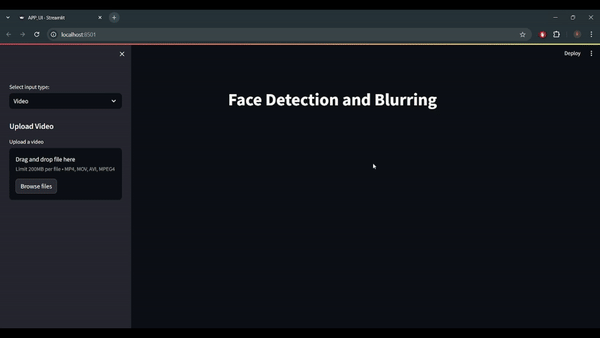

# Face Detection and Blurring

This project demonstrates face detection and blurring using OpenCV and MediaPipe. It includes two implementations:

1. **Command-Line Tool**: A Python script for processing images, videos, and webcam feeds via command-line arguments.
2. **Streamlit Web App**: A Streamlit-based web application for image and video processing, with an interactive user interface.

---

## Command-Line Tool (`APP_CLI.py`)

### Overview

This script processes images, videos, and webcam feeds from the command line. It can detect faces and apply a blurring effect to them.


### How to Use

1. **Install Dependencies**

    ```bash
    pip install opencv-python mediapipe
    ```

2. **Run the Script**

    ```bash
    python command_line_tool.py --mode [image|video|webcam] --filePath [path/to/your/file]
    ```

    - **`--mode`**: Choose between `image`, `video`, or `webcam`.
    - **`--filePath`**: Path to the image or video file (not required for webcam mode).

3. **Output**

    - Processed images or videos will be saved in the `./output` directory.
    - For webcam mode, the processed video feed will be displayed in a window.


## Streamlit Web App (`APP_UI.py`)

### Overview

This web application provides a user interface for uploading and processing images and videos. It supports face detection and blurring, with live previews for video processing.

### Requirements

- Python 3.x
- OpenCV
- MediaPipe
- Streamlit
- PIL (Pillow)

### How to Use

1. **Install Dependencies**

    ```bash
    pip install opencv-python mediapipe streamlit pillow
    ```

2. **Run the Streamlit App**

    ```bash
    streamlit run streamlit_app.py
    ```

3. **Web App Features**

    - **Image Processing**: Upload an image to detect and blur faces.
    - **Video Processing**: Upload a video to detect and blur faces frame by frame.

### UI Layout

- **Sidebar**: Contains options to select the input type (`Image` or `Video`) and upload files.
- **Main Page**: Displays the processed images or video frames.
---

## Video Showcase

Here's a video showcasing the Streamlit web app:



